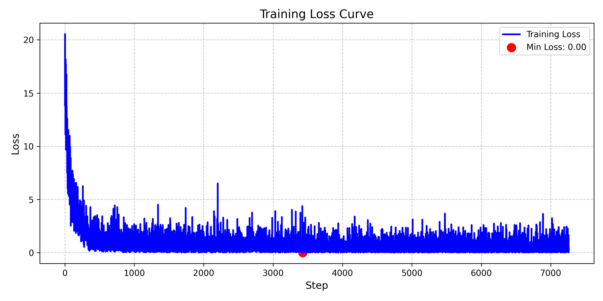

### 使用transformers库对T5微调

### 模型训练
```shell
python train.py
```

### 测评BLEU-1234

```shell
python eval.py
```
| Metric   | Score   |
|----------|---------|
| BLEU-1   | 0.4639  |
| BLEU-2   | 0.1467  |
| BLEU-3   | 0.0999  |
| BLEU-4   | 0.0825  |