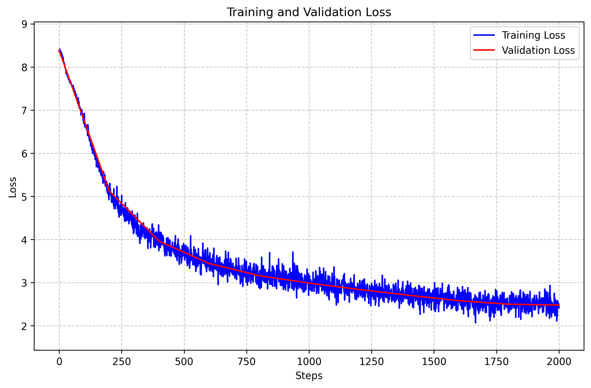

## torch写的llama预训练

### 1.tokenizer train
```shell
python ./preprocess_tokenizer.py
```
### 2.datasets 

```shell
python ./preprocess_data.py
```

### 3.model init,tokenizer init

```shell
model.py  tokenizer.py
```

### 4.model train
```shell
python train.py
```


